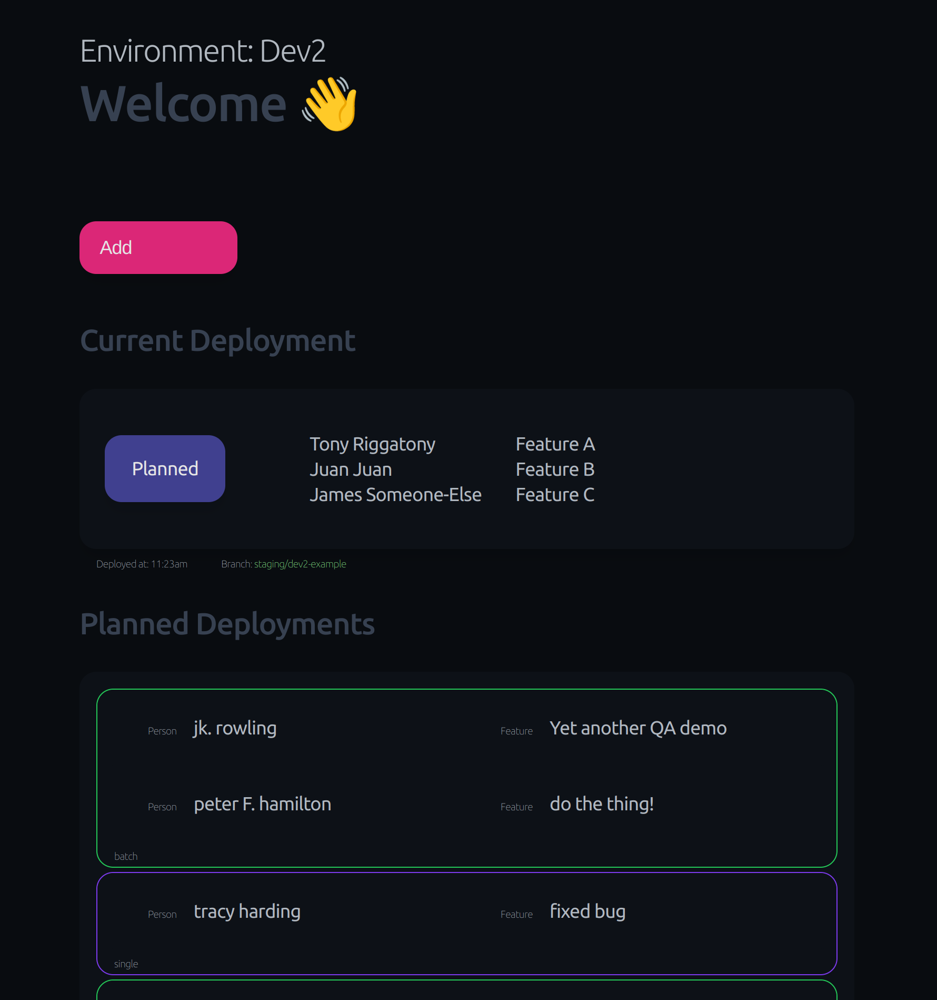

# Queuear

> A solution to "who's turn is it anyways?" and "how many devs does it take to deploy a test build?"

<p align="center">
    <a href="https://github.com/albert118/queuear/blob/master/LICENSE">
        
    </a>
    <a href="https://github.com/albert118/queuear/blob/master/README.md">
        
    </a>
    <a href="https://github.com/albert118/queuear/blob/master/queuear/README.md">
        
    </a>
    <a href="https://github.com/albert118/queuear/blob/master/Dockerfile">
        
    </a>
</p>

## 👑 Features

- view what code is currently deployed and by who
- plan upcoming deployments by joining a queue
- join an existing deployment group or or request a single deployment

## 📌 Getting started

To start the development server run,

```sh
nx serve queuear
```

Open your browser and navigate to <http://localhost:4200/>. Happy coding!

To preview the production server run,

```sh
nx run queuear:build:production
nx run queuear:serve:production
```

This project uses nx and is configured with a variety of tasks. Typically, they are formatted as `nx run project:task`
Learn more [in the Nx docs](https://nx.dev/core-features/run-tasks).

Likewise visit <http://localhost:4200/> again.

## 👀 Examples



## Production Deployment

Build and run a docker container with the deployed application. Configuration is pulled from the `.env` file.

```sh
nx run queuear:deploy
```

Or alternatively, build and manually deploy the container/stack as needed

```sh
nx run queuear:docker-build
docker run --env-file ./.env -p 4200:4200 -it queuear
# or
docker compose up
```
